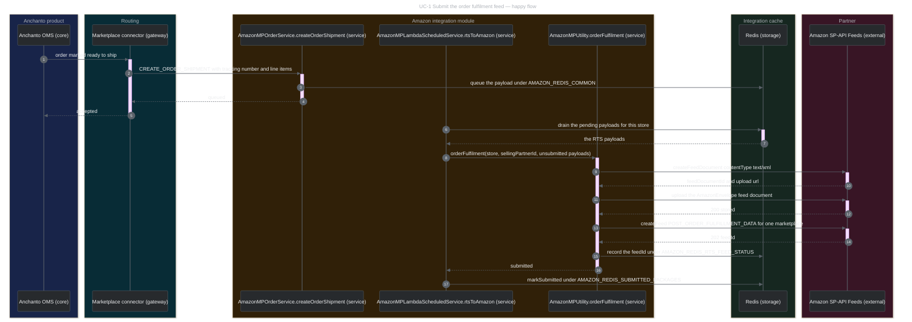
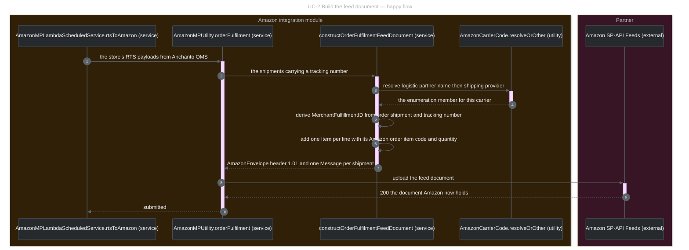
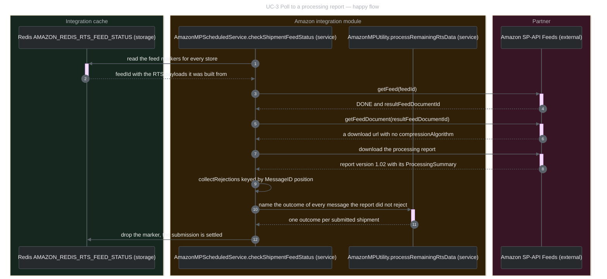
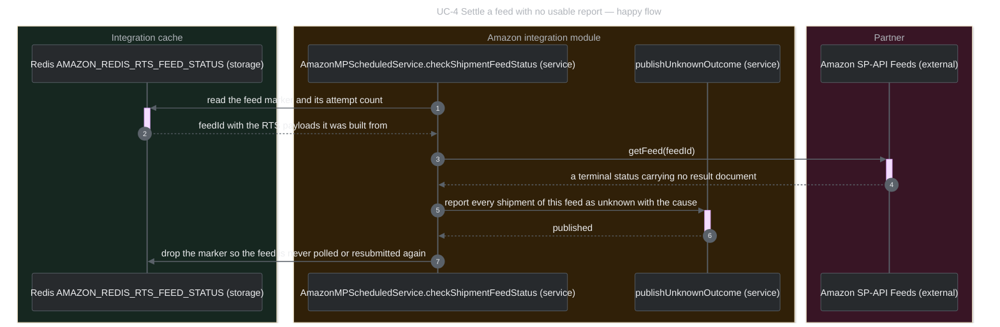
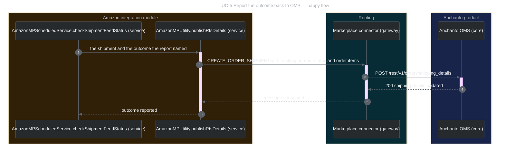

# IA-5109 US3 — Flow 1 test suites

**Flow 1 is the `POST_ORDER_FULFILLMENT_DATA` order fulfilment feed**, the mechanism `D1` / `P-2`
selects. `confirmShipment` is Flow 2 and `D1` defers it until the multi-package phase begins, so no
suite in this folder calls it.

Five use cases, forty cases. Each use case opens with the one happy flow it exercises — no branches,
no error legs — and is followed by the data-driven matrix of the cases that vary that flow's inputs.
Every row names what happens and what each component holds afterwards.

---

## The components

Three parties and one internal module, which is where most of the behaviour lives.

| Component | What it owns in Flow 1 | Data you can collect from it |
|---|---|---|
| **Anchanto OMS** | the seller's order; marks it ready to ship; receives the confirmation outcome | the `CREATE_ORDER_SHIPMENT` notification it sends (order number, tracking number, shipping provider, `line_items[*]`); the `shipping_details` write-back it accepts — `tracking_number`, `status`, `failure_reason`, `order_items[]`; the tracking the seller then sees on the order |
| **Marketplace connector** (`connector/marketplace-connector`) | routes `CREATE_ORDER_SHIPMENT` both ways between OMS and the integration | the message on the connector topic, in both directions; `POST /rest/v1/orders/shipping_details` as it is put to OMS |
| **Amazon integration module** (JPluger, legacy `marketplace-integrations`) | builds, submits, polls and reports the fulfilment feed | see the internal components below |
| **Amazon SP-API** (Feeds `2021-06-30`) | accepts the feed document, processes it, answers the feed status and the processing report | the feed document it received; the feed record — `feedId`, `feedType`, `marketplaceIds`, `inputFeedDocumentId`, `createdTime`; `getFeed`'s `processingStatus` and `resultFeedDocumentId`; the processing report — `StatusCode`, `ProcessingSummary`, `Result*` |

### Inside the Amazon integration module

| Internal component | Its part in Flow 1 | Data you can collect from it |
|---|---|---|
| `AmazonMPOrderService.createOrderShipment` | the ingress: accepts the RTS notification, refuses to queue a package already submitted, queues the rest | the pending payload in Redis `AMAZON_REDIS_COMMON` / `AMAZON_CREATE_ORDER_SHIPMENT`; the log line naming order number and tracking number |
| `SubmittedPackageGuard` | the duplicate guard, checked at the ingress and again immediately before submitting | the package markers in Redis `AMAZON_REDIS_SUBMITTED_PACKAGES` |
| `AmazonMPLambdaScheduledService.rtsToAmazon` | drains the pending payloads per store, submits them, marks them submitted only when Amazon actually holds them | the batch size logged per store; whether `markSubmitted` ran (`isResponseFailure` decides) |
| `AmazonMPUtility.constructOrderFulfilmentFeedDocument` | builds the mapping-4.2 `AmazonEnvelope` — one `Message` per confirmable shipment | the feed XML, logged in full before upload; the blocked-confirmation log line |
| `AmazonCarrierCode.resolveOrOther` | resolves the carrier against Amazon's closed 594-member enumeration | the resolved `CarrierCode`, and `Other` plus `CarrierName` when nothing matched |
| `AmazonMPUtility.feedUploadAndProcess` | `createFeedDocument` → upload → `createFeed`, then records the feed for polling | the feed id in Redis `AMAZON_REDIS_RTS_FEED_STATUS`, keyed to the store and its RTS payloads |
| `AmazonMPScheduledService.checkShipmentFeedStatus` | every two minutes: reads the markers, polls `getFeed`, downloads the report, names one outcome per message, bounds what never settles | the marker re-saved or dropped; the attempt count; `collectRejections`' `MessageID` keys; the outcome per shipment |
| `AmazonMPUtility.publishRtsDetails` / `publishUnknownOutcome` | reports one shipment's outcome back through the connector | the `CREATE_ORDER_SHIPMENT` message published — `tracking_number`, `status`, `failure_reason`, `order_items[]` |

### How each component is stood in for in a local run

**These suites do not start JPluger.** They stand in for the integration themselves — `requirements.py`
is a reference implementation of the same wire shapes — and drive the two parties around it. So a
green run means *the documents and the parties agree*, not that the integration works.

| Component | In a local run | Where the integration side is actually proved |
|---|---|---|
| Anchanto OMS | `anchanto-oms` mock, started in-process on an OS-assigned port; the write-back lands in its `shipping_pushes` store | — |
| Marketplace connector | not run; the suite posts to OMS directly, as the connector does | — |
| Amazon integration module | **not run**; `requirements.py` builds and reads the same shapes | `AmazonMPUtilityTest` (`FeedSubmissionAgainstTheLocalMock`, `WhatTheFeedCarries`), `AmazonMPScheduledServiceTest`, `AmazonRtsWriteBackAndDuplicateTest` — `D-25`, built through `marketplace-integrations/pom-legacy.xml` |
| Amazon SP-API | `amazon` mock on `127.0.0.1:23103`; what Amazon received is its `feed_uploads` store, what Amazon created is `feeds` | — |

Throughout the matrices, the shorthand for a mock-side observable is the store it lands in:
`feed_uploads[].body` is the feed document Amazon received, `feeds[]` the feed it created, and
`shipping_pushes[]` the `shipping_details` request OMS accepted. Every run also copies the HAR call
log beside its `results.json`.

Case ids below drop the shared `IA-5109-US3-` prefix.

---

## UC-1 — Submit the order fulfilment feed

The seller marks an order ready to ship; the notification is queued, drained per store, and reaches
Amazon as a feed in three calls. The feed id is kept for the poll, and only then is the package
marked submitted.



### Data-driven test matrix

| Case | Data in | Expected result — what happens | Amazon SP-API — data | Amazon integration — data | Anchanto OMS — data |
|---|---|---|---|---|---|
| `FEED-CHAIN` | one shipment, tracking `CJ-55812-CHAIN` | `createFeedDocument` 201 → upload 200 → `createFeed` 202 → `getFeed` 200; the fulfilment feed carries its own id so it cannot collide with an acknowledgement feed, and answers `POST_ORDER_FULFILLMENT_DATA`, `DONE`, `resultFeedDocumentId feed-doc-res-fulfilment-100001`; the document Amazon holds is character-for-character what was sent | the received document (`feed_uploads[].body`); the feed record `feed-fulfilment-100001` (`feeds[]`); the four calls in the HAR | `feedUploadAndProcess` keeps the feed id under `AMAZON_REDIS_RTS_FEED_STATUS`, keyed to the store and its payloads — the poll's only handle on this submission | — |
| `FEED-METADATA` | a fulfilment feed for `amazon_sp_fr` | the submission is scoped to one store and one document: `feedType POST_ORDER_FULFILLMENT_DATA`, `marketplaceIds ['A13V1IB3VIYZZH']`, `inputFeedDocumentId feed-doc-100001` | the feed record's three fields (`feeds[]`) | the marketplace id is injected from `AmazonConstant.AMAZON_AUTH_DETAILS_MAP` by marketplace code; the feed type is the constant for shipment confirmation | — |
| `FEED-MARKETPLACES` | one `createFeed` per cross-border market: FR `A13V1IB3VIYZZH`, DE `A1PA6795UKMFR9`, JP `A1VC38T7YXB528`, US `ATVPDKIKX0DER` | each submission records its own marketplace id, and the four are distinct — no two markets share a feed scope | four feed records, one `marketplaceIds` each | one auth-map entry per marketplace code; `D-14` stays blocked on `P-4` — three of the four import no orders at all, so this pins the id, not acceptance | — |
| `FEED-DOC-REFUSED` | `createFeedDocument` with `contentType INVALID` | refused 400 before anything is uploaded, and the answer names the failure | 400 and `errors[0]` in the HAR; no document, no upload | `orderFulfilment` returns a failure, so `markSubmitted` does not run and the package stays eligible for a later attempt | the shipment's failure is reported separately — UC-5 |
| `FEED-CREATE-500` | `createFeed` with `feedType SERVERERROR` | answers 500, and no submission is recorded — a refused `createFeed` yields nothing to poll | no feed record for that feed type (`feeds[]`) | no feed id under `AMAZON_REDIS_RTS_FEED_STATUS`; the package is not marked submitted | as above |

---

## UC-2 — Build the feed document to mapping 4.2

What the integration puts on the wire. Shipments with no tracking number are refused before the
first Amazon call; the rest become one `Message` each, with the carrier resolved against Amazon's
enumeration and a derived, stable fulfilment identifier.



### Data-driven test matrix

| Case | Data in | Expected result — what happens | Amazon SP-API — data | Amazon integration — data | Anchanto OMS — data |
|---|---|---|---|---|---|
| `BODY-HEADER` | a shipment on the live payload's carrier shape | the envelope names the seller and the message type: `DocumentVersion 1.01` — what we send, against the 1.02 Amazon's own report carries — `MerchantIdentifier`, `MessageType OrderFulfillment` | the `Header` of the received document | the selling partner id comes from the store's auth details | — |
| `BODY-NO-TRACKING` | a batch of two: one with `tracking_number` null, one with `CJ-55812-KEPT` | the shipment with no tracking number is refused before the first Amazon call and never confirmed under a substitute; the refused order number appears nowhere in the feed; the sibling still ships, with the carrier's own tracking number | one `Message` only; `ShipperTrackingNumber` is the carrier value, never the order number | the refusal is recorded by `recordBlockedConfirmation`, not swallowed; the batch is not abandoned with it | the refusal is written back as a failure — UC-5 `WB-REFUSED-REPORTED` |
| `BODY-ITEMS` | two lines: `90114455` code `05015851154158` qty 2, `90114456` code `05015851154159` qty 3 | every covered line reaches Amazon as its own `Item`, carrying its `AmazonOrderItemCode` and its own `Quantity` | two `Item` elements with 2 and 3 | `addFulfilledItems` reads `getLineItems()` — before this work the builder never called it, so no item detail reached Amazon at all; per-package allocation is `D-5`, blocked on `CR-1` | the line ids come from the OMS notification |
| `BODY-ITEM-NO-CODE` | first line with an empty `mp_item_codes`, second with `05015851154159` | the codeless line is left out rather than sent under a substituted code, and its sibling still goes | one `Item`, the sibling's | `amazonOrderItemCode` returns none and the line is skipped and logged; `N-13` is OPEN — whether to skip the line or refuse the whole confirmation is unsettled | — |
| `BODY-QUANTITY-ZERO` | one line, quantity `0` | the line is still named by its code, and the optional `Quantity` is omitted — Amazon types it as a positive integer, so a zero would fail the schema | `Item` with a code and no `Quantity` | the builder omits the element rather than sending zero | the quantity arrives on `line_items[*].quanity`, the misspelled wire key |
| `BODY-CARRIER-MATCHED` | `shipping_provider DHL` | the carrier is sent as the enumeration member itself, with no `CarrierName` beside it; `ShippingMethod` carries the shipping type | `CarrierCode DHL`, no `CarrierName`, `ShippingMethod FPP (Fixed Price Premium)` | `AmazonCarrierCode.resolveOrOther` matched; passing the raw name through is what broke parsing before | the carrier identity comes from the notification's logistic partner name and shipping provider |
| `BODY-CARRIER-CASE` | `shipping_provider 'dhl express'` | resolution is case-insensitive and answers with Amazon's published spelling | `CarrierCode DHL Express`, no `CarrierName` | the enumeration is keyed lower-case, earliest member in schema order winning — Amazon publishes fifteen pairs differing only in case | — |
| `BODY-CARRIER-SELF-DELIVERY` | `shipping_provider 'Self Delivery'` with logistic partner `Ignored Partner` | `Self Delivery` is itself a member, so it goes verbatim rather than as `Other`, and the partner name beside it is dropped | `CarrierCode Self Delivery`, no `CarrierName` | the precedence lives on the tree and in no mapping row — note `N-14`, a GAP | — |
| `BODY-CARRIER-OTHER` | `shipping_provider 'quipup'`, logistic partner `QuipUp` | an unmapped carrier falls back to `Other` carrying its real name — the confirmation stays valid and Amazon-side tracking is lost | `CarrierCode Other`, `CarrierName QuipUp` | an unmapped carrier is a configuration defect to fix, not a steady state | the seller still sees the tracking number OMS sent |
| `BODY-MERCHANT-FULFILMENT-ID` | the same shipment built twice, and once more with tracking `DIFFERENT-TRACKING` | the identifier is stable across a rebuild, positive, inside `IDNumber`'s twenty digits, and different when the tracking number differs | `MerchantFulfillmentID` on the received document | `merchantFulfillmentId` derives it — SHA-256 over order, shipment and tracking number, eight bytes, never stored — so a resubmission of the same package carries its first value | — |
| `BODY-FULFILMENT-DATE` | a shipment carrying purchase instant `2026-08-20T09:12:03Z` | `FulfillmentDate` is the receipt instant with its offset spelled out, not the buyer's purchase instant, and ISO 8601 to the second | `FulfillmentDate` on the received document; Amazon rates late shipment on this field | `D9`'s labelled interim proxy until `CR-3` lands; the format it replaced carried no offset and rendered differently per host timezone | the notification carries no fulfilment instant at all — hence the proxy |
| `BODY-MESSAGE-IDS` | two shipments submitted on one feed | `MessageID` is the 1-based position in the submitted list, and every message carries `OperationType Update` | two `Message` elements, ids 1 and 2 in submitted order | the processing report names failures by `MessageID` alone, so the submitted list is the correlation key and nothing may be dropped from it after it is built | — |

Integration side proved by `AmazonMPUtilityTest.WhatTheFeedCarries` — claims `C-1`, `C-2`, `C-3`,
`C-5`, `C-13` — and `AmazonMPUtilityTest.FeedSubmissionAgainstTheLocalMock` for `D-25`.

---

## UC-3 — Poll to a processing report and name each outcome

Every two minutes the drain reads its feed markers, polls each feed, downloads the processing report
and names one outcome per submitted message. The report is the only thing that settles a message.



### Data-driven test matrix

| Case | Data in | Expected result — what happens | Amazon SP-API — data | Amazon integration — data | Anchanto OMS — data |
|---|---|---|---|---|---|
| `POLL-CLEAN` | feed `feed-fulfilment-100001`, clean result document | the report reads 2 processed, 2 successful, 0 errors, 0 warnings and carries no `Result` element at all; both messages settle `submitted-and-not-rejected` | `DONE` with the clean result document; the report body | the outcome comes from the report and nowhere else — the previous code published success for a report counting `MessagesWithError=1`; the marker is then dropped | both shipments are written back as `success` — UC-5 |
| `POLL-REJECT` | feed `feed-fulfilment-reject-1`, rejecting result document | a rejecting feed still completes: `DONE`, 2 processed, 1 successful, 1 error, one `Result` naming `MessageID 2`, `ResultCode Error`, `ResultMessageCode 18028` and a description; message 1 is untouched, message 2 carries Amazon's reason | the rejecting report body and its result document id | `collectRejections` keys the rejection to submitted position 2 only; the sibling is not marked failed | message 1 → `success`, message 2 → `failure` carrying Amazon's `ResultDescription`, which is what the seller acts on |
| `POLL-VARIANTS-DIFFER` | both result documents fetched in one run | the two bodies differ on the wire and read to different outcomes — the clean one rejects none, the rejecting one rejects exactly the message it names | both report bodies; six calls in the HAR | the same reading code produces both outcomes; nothing steers on anything but the report | two different write-backs |
| `POLL-DONE-NOT-ACCEPTANCE` | the clean processing report | reaching `DONE` is completion, never acceptance: `StatusCode Complete`, no success result code, no `AmazonOrderID` named anywhere | the report's absence of any non-`Error` `Result` | the three outcomes are `submitted-and-not-rejected`, `rejected`, `unknown`; acceptance would be read back under `P-6`, which is not built | `success` on OMS's two-valued status field — the closest OMS can carry, and not a claim Amazon accepted |
| `POLL-UNATTRIBUTABLE` | the rejecting report read against a feed that carried **one** message | the out-of-range `MessageID` is attributed to nothing, no rejection is keyed to a shipment, and no message may be published as not-rejected — the whole feed becomes unknown | the same report body | `attributable` goes false and the feed settles as `unknown`; publishing a success for any of them is the misreport `C-12` exists to prevent | `unknown`, never a fabricated `success` |
| `POLL-REPORT-URL` | result document id `feed-doc-res-fulfilment-100001` | `getFeedDocument` echoes the id, hands back a download url and names no `compressionAlgorithm` | the document answer | the report is fetched at once and its url never stored — it expires after five minutes; `download()` is called with compression null, so a compressed body would not be read | — |
| `POLL-REPORT-BODY` | the download url just returned | the body is uncompressed XML and parses into exactly one `ProcessingReport` | the raw report body | the element shape the JAXB models unmarshal into: `AmazonEnvelope` > `Message` > `ProcessingReport` | — |
| `POLL-REPORT-MISSING` | result document id `feed-doc-NOTFOUND` | 404 on `getFeedDocument` **and** 404 on the download, so a missing report cannot be mistaken for an empty one | two 404s in the HAR | a `DONE` feed whose report cannot be read is `unknown`, never success | `unknown` |

Integration side proved by `AmazonMPScheduledServiceTest` — claims `C-6`, `C-12`, `D-25`.

---

## UC-4 — Settle a feed that yields no usable report

The same poll ending without a report: a terminal status that carries none, or a status that never
turns terminal inside the bounds. All of them settle as `unknown`, and none is resubmitted — the
feed may already have applied the message at Amazon.



### Data-driven test matrix

| Case | Data in | Expected result — what happens | Amazon SP-API — data | Amazon integration — data | Anchanto OMS — data |
|---|---|---|---|---|---|
| `POLL-FATAL` | feed `feed-FATAL-1` | `FATAL` is terminal and carries no usable report, so the outcome is `unknown` rather than failed; polling again submits nothing | `processingStatus FATAL`; the feed record count unchanged after a second poll | `FATAL` leaves some, none or all messages applied, so resubmitting risks a second confirmation — the previous code re-queued a FATAL feed on every pass, without bound; deviates from the ticket's "mark package failed" by recorded design | `unknown` with the cause, for reconciliation rather than retry |
| `POLL-CANCELLED` | feed `feed-CANCELLED-fulfilment-1` | grouped with `FATAL`: no result document, no `createdTime`, and only treating it as terminal settles it | `processingStatus CANCELLED`, both fields absent | note `N-16` is a GAP — no claim covers what `CANCELLED` means for a submission Amazon may already hold, and `unknown` never misreports | `unknown` |
| `POLL-IN-PROGRESS` | feed `feed-INPROGRESS-UNDATED-1` | `IN_PROGRESS` is neither `DONE` nor terminal-without-report, and offers no result document and no `createdTime` | the feed answer | with no `createdTime` the document-lifetime bound cannot fire, so the attempt bound is the only one that can settle it | nothing yet — the poll continues |
| `POLL-ATTEMPT-BOUND` | thirty polls of the undated `IN_PROGRESS` feed | every answer is `IN_PROGRESS`, and attempt 30 settles the submission as `unknown` rather than polling on | 30 `getFeed` calls in the HAR, one answer | thirty attempts is roughly an hour at the drain's two-minute schedule; the count lives in memory and resets on a pod restart — `specs` §9 #7, out of this story | `unknown` |
| `POLL-LIFETIME-BOUND` | the fulfilment feed's own `createdTime` | the feed is already older than the two-day lifetime of the document it was built from, so it is settled at once instead of asked again | `createdTime` on the feed record | this bound survives a pod restart because Amazon owns `createdTime`, which the attempt count does not | `unknown` |
| `POLL-UNREADABLE` | feed `feed-NOTFOUND-1`, polled three times | `getFeed` answers 404 every time — the error is stable — and the `ApiException` path is bounded like any other rather than retried forever | three 404s in the HAR | the previous code retried a permanently failing `getFeed` without end | `unknown` on the bound |

Integration side proved by `AmazonMPScheduledServiceTest` — claims `C-7`, `C-19`.

---

## UC-5 — Report the outcome back to Anchanto OMS

One `CREATE_ORDER_SHIPMENT` message per shipment, through the connector, onto the order the seller
is looking at. The status is what OMS can tell apart; the tracking number is what OMS itself sent.



### Data-driven test matrix

| Case | Data in | Expected result — what happens | Amazon SP-API — data | Amazon integration — data | Anchanto OMS — data |
|---|---|---|---|---|---|
| `WB-NOT-REJECTED` | outcome `submitted-and-not-rejected`, tracking `CJ-55812-OK`, OMS order id `41277` | accepted 200 and recorded once: `status success`, the tracking number exactly as OMS sent it, no failure reason, and the order id identifying the shipment | the message the report did not reject | `publishRtsDetails` sets `success` and leaves `failure_reason` unset; OMS's status field admits two values today, so this outcome rides the existing one | the `shipping_details` row (`shipping_pushes[]`); the seller sees the buyer's tracking on the order |
| `WB-REJECTED` | outcome `rejected`, reason `Invalid tracking id for carrier Other` | `status failure` carrying Amazon's own `ResultDescription`, and the tracking number is not blanked by the rejection | the `Result` the report named | `publishRtsDetails` copies the description into `failure_reason` — the only free-text slot OMS reads | the seller reads why the confirmation failed; re-driving it is Cluster A and is not built |
| `WB-UNKNOWN` | outcome `unknown`, reason `feed reached a terminal status carrying no processing report` | `status unknown` — its own value, distinct from `failure` — with the cause carried so the submission can be reconciled, and the tracking number kept so the package can be found | — | `publishUnknownOutcome`; telling OMS the confirmation did not happen would send the seller to re-confirm a package Amazon may already hold | blocked on `CR-5`: OMS is asked to accept the third value and has not yet; `N-15` is open beside it — whether OMS reads a populated `failure_reason` as failure regardless of the status is NOT ESTABLISHED |
| `WB-THREE-DISTINCT` | one write-back of each outcome | three distinct statuses reach OMS — `success`, `failure`, `unknown` — and `unknown` is not `failure` | — | every submission reaches exactly one of three terminal outcomes; collapsing two of them is the misreport the third exists to prevent | three rows, three statuses |
| `WB-NEVER-ORDER-NUMBER` | a shipment OMS sent with **no** tracking number | the write-back carries no tracking number rather than a stand-in, and the order number appears nowhere in the payload; the OMS contract then answers **422** and records nothing | — | the previous code substituted `getOrderNumber()`; OMS shows this field to the seller as the buyer's tracking, so that is a fabricated tracking number rather than an absent one | **FINDING**: `anchanto-oms.mock.json` declares `shipping_details.tracking_number` REQUIRED, so the very write-back `C-11` mandates is refused by the contract on disk — asserted as observed, neither mock edited to make it pass |
| `WB-REFUSED-REPORTED` | a batch of two, one refused for having no tracking number | the refused shipment reaches Amazon on no path yet is still reported as a **definite** failure with its reason — not left to a log — and its sibling's own outcome still lands; the refusal itself is turned away 422 | one `Message` only reached Amazon | the confirmation was never submitted, so the outcome is determined — a failure, not the `unknown` an undecidable feed earns | the sibling's `success` row lands; the refusal does not, on the same finding as above |
| `WB-LINE-ITEMS` | two lines: `90114455` qty 2, `90114456` qty 3 | the outcome names every line it covers, each with the OMS line id as a string and its quantity | — | `publishRtsDetails` casts the line id to string and copies `quanity` through; per-package allocation is `D-5`, blocked on `CR-1` — this is per order | `order_items[]` on the recorded row, matching the lines OMS sent |
| `WB-SIBLING-ISOLATION` | one feed whose report rejects the second message only | message 1 writes back `success` with no reason and message 2 `failure` with its own; two rows under two tracking numbers | the report rejecting position 2 | a rejected message must not mark its sibling failed; carton-grouped packages still need `CR-1` and `CR-4` | two rows, no reason leaking across |
| `WB-OMS-REFUSES` | `failure_reason` carrying the mock's `SERVERERROR` marker | OMS answers 500 and nothing is recorded, so a refused write-back cannot be read as one that landed | — | re-driving a refused write-back is Cluster A and nothing on the tree does it | no row for that tracking number |

Integration side proved by `AmazonRtsWriteBackAndDuplicateTest` — claims `C-11`, `C-14`, `F3` — and
`AmazonMPScheduledServiceTest` for `C-12`.

---

## Running them

```bash
cd local-test-servers
python3 amazon/IA-5109-US3/suite-all.py             # all 40, four readable runs
python3 amazon/IA-5109-US3/suite-feed-submission.py # UC-1 and UC-2, 17 cases
python3 amazon/IA-5109-US3/suite-feed-poll.py       # UC-3 and UC-4, 14 cases
python3 amazon/IA-5109-US3/suite-oms-writeback.py   # UC-5, 9 cases
python3 amazon/IA-5109-US3/suite-all.py --list      # every case id
python3 amazon/IA-5109-US3/suite-feed-poll.py IA-5109-US3-POLL-FATAL   # one case
```

The Amazon mock is attached to on `23103` if it is already listening and started in-process if it is
not; the OMS mock is always started in-process on an OS-assigned port against run-scoped state, so a
suite never writes into the portal server's own stores.

Each run writes `amazon/test-results/<suite-id>/run-<stamp>/results.json` — one entry per case with
its verdict and every check as `expected` against `actual` — and copies the mock's HAR call log
beside it, so a verdict traces back to the calls that produced it. The mock's `/test` page renders
the same file.
