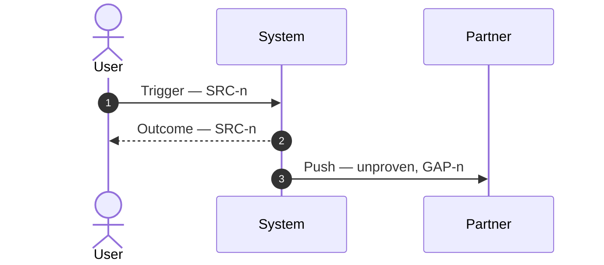

<!-- HOW TO FILL THIS FILE

     THIS FILE IS THE PROOF THE BUSINESS IS UNDERSTOOD. It is what the human approves at G1, so
     write it for a human reader judging whether you got their intent right — not for yourself.

     Fill in this order. Each step feeds the next, and the same order says which question is
     askable when.
       1. §1 The value — the specific case where today's behaviour fails, and who hits it.
       2. §2 The workflow — every participant and arrow, before any criterion is written. A
          criterion written first describes a flow you have not yet proven exists.
       3. §3 Acceptance criteria, from §2 and the interview.
       4. §4 Technical constraints, from the interview — always, see below.

     THIS FILE MINTS AC (§3) AND NFR (§4). Both are contiguous and local to their table: AC-1, AC-2,
     AC-3, with the number being the row. They must be countable in one glance, because
     the test plan's phase 1 (implementation-plan.md §4) is checked against the criteria (§3) as
     one list against another.
     Everything else is CITED and never restated. The Source column carries the bare SRC-n from
     raw-context.md, which holds the paths, or `<who>, <date>` for something said aloud.
     No zero-padding: AC-1, not AC-01.

     NFR ARE MINTED HERE, ALWAYS. Supplied material routinely carries acceptance criteria and no
     technical constraints — a document written at behaviour altitude has no home for logging, rate
     limits, retries or fault tolerance, so it states none. Fill the constraints (§4) from the
     interview whether or not the criteria (§3) arrived written. An empty §4 approved at G1 is an empty §4 that the code review then
     verifies against nothing.

     A PRE-WRITTEN CRITERION IS STILL THE HUMAN'S TO CONFIRM, NOT THE DOCUMENT'S. Transcribing AC
     rows out of supplied material empties the frontier early and turns G1 into a countersignature
     on a document the approver wrote. Read the rule set back anyway, and attribute each row to its
     source.

     THE HUMAN IS THE AUTHORITY ON INTENT. Every rule they state directly becomes an AC or an NFR
     here, in their terms. Inbound domain payload data is relayed as received; mutating it to work
     around a contract behaviour needs an explicit instruction, and that instruction is a decision
     line in raw-context.md, not an assumption here.

     EVERY WORKFLOW ARROW (§2) CARRIES ITS EVIDENCE AT THE END OF ITS LABEL — `— SRC-n` or
     `— <who>, <date>`, from an authoritative document or a code entry-point trace; an arrow you
     have not proven ends `— unproven, GAP-n` and opens that gap in the same breath. The label is
     the channel because sequence diagrams spend line style on request against reply, and a dashed
     "unproven" arrow (`-.->`) is flowchart syntax mermaid silently parses as a new participant
     with a solid arrow. The diagram's job is to show what you know apart from what you assumed.
     PARTICIPANTS CARRY THE FILE'S OWN NAMES, never an initial or an alias — `W`, `C`, `J` cost the
     reader a question each. A participant name is one of the names §1 already uses.
     THE WORKFLOW (§2) IS THE ONLY ONE IN THE FOLDER. The implementation plan carries no flow
     section.

     The done-when list is the only ceiling — a file that satisfies it is long enough. Delete a
     section you have nothing for, except the technical constraints (§4), which always carry a row
     or the one line saying why there is none — an empty section is noise, a missing one is
     information.

     DONE WHEN:
       - the value (§1) names a case that fails today, not a fix;
       - every workflow arrow's (§2) label ends in its source, or in `unproven` with its gap;
       - every criteria row (§3) is Given / When / Then, observable, and carries a Source;
       - the constraints (§4) have at least one row, or one line saying the interview produced
         none and why;
       - every AC and NFR number is contiguous from 1, with no hole and no repeat;
       - every <placeholder> is replaced, and every example row is deleted;
       - after the strip, the file holds no <!-- at all;
       - the human confirmed the rule set read back to them.

     STRIP THIS COMMENT AND THE ONE BELOW at the end of Step 1, before the G1 request. A reviewer
     judges the result, not the method; rules left in the file invite a compliance check instead of
     a quality one. -->

<!-- WRITING RULES — they apply to every section

     Altitude. This file names systems, flows and behaviour, and says what must become true. Below
     that line — module, class, file, method, property, column, schema — is the developer's
     document, not yours. The test: a reader could rename every class in the repo and not change a
     word of this file. "The sync asks the partner for one page and never asks for the next" — not
     "the order service passes a null page token".

     Carry behaviour and value. Wire format, endpoints and payloads live in mapping-plan.md and the
     specs, never here.

     Evidence. Every row names what it rests on. Link the source at the claim that rests on it, not
     in a header nobody reads. Stop a claim where the evidence stops — a verb you have not read is
     a guess wearing a verb.

     Vocabulary. Name each component once, in plain language, and reuse that exact name everywhere
     below. A second name for the same component is a second vocabulary, and a reader can no longer
     follow one thread through the file.
     Name an Anchanto product in full on first use — "Anchanto OMS (SelluSeller)", "Anchanto WMS
     (Wareo)", "Anchanto OXM". A bare `OMS`, and any name holding `wms`, resolve to the wrong system.

     Words, not codes. Write "the ticket's UI section", not "§15". Identifiers owned outside this
     workspace keep their real form — a Jira key, an endpoint path, a field name in someone else's
     contract. AC and NFR stay as codes here, because they are what somebody cites back at you.

     Sentences. The writing-a-line rules (SKILL.md · The log) bind every sentence and every quote
     here too. -->

# Feature: `<feature name>`

| | |
|---|---|
| **State** | see `raw-context.md` §0 |
| **Target module** | `<module>` |
| **Spec folder** | `<area>/specs/<integration>/`, or *none* |

---

## 1. The value

**As a** `<persona>`,
**I want to** `<action>`,
**So that** `<business benefit>`.

**The case that fails today:** `<the specific case where current behaviour breaks, and who hits it>`

**Trigger:** `<what starts this>`

**Out of scope:** `<what this explicitly does not cover>`

---

## 2. The workflow

---

## 3. Acceptance criteria

*These define the boundaries of the feature. `implementation-plan.md` §4 phase 1 gives each one a
test, one row per criterion.*

| ID | Scenario (Given / When / Then) | Source |
|---|---|---|
| AC-1 | **Given** `<pre-condition>`, **When** `<action>`, **Then** `<observable outcome>`. | `<SRC-n / who, date>` |
| AC-2 | **Given** an invalid input, **When** processed, **Then** an error is logged and the run continues. | `<SRC-n / who, date>` |

---

## 4. Technical constraints

*Hard rules on logging, rate limiting, retries, fault tolerance, performance, security or data
fidelity. Minted here from the interview, whether or not §3 arrived pre-written.*

| ID | Constraint | Source |
|---|---|---|
| NFR-1 | `<the constraint, stated so a test could fail against it>` | `<SRC-n / who, date>` |
