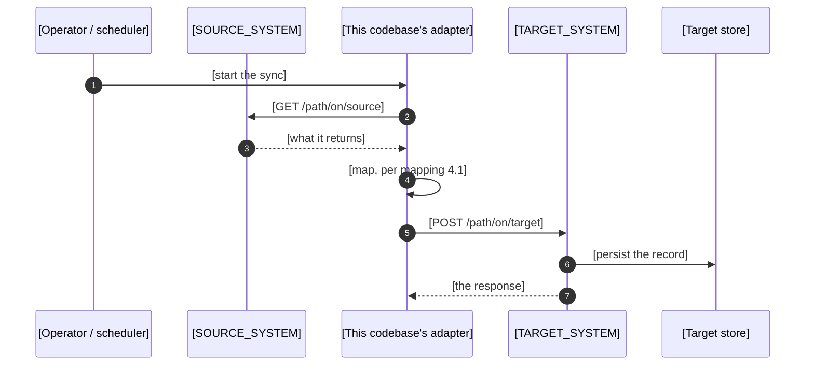
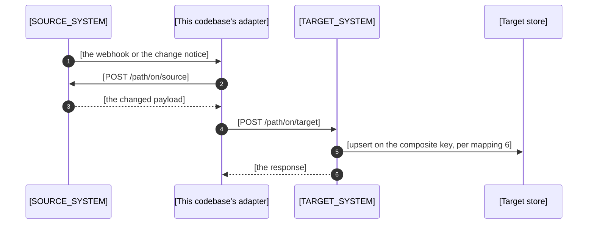

# [KEY] Specs — [Short Feature Title]

**Document Identifier:** `[KEY]-[TOPIC]-specs.md`
**Requirement:** `[KEY]` — [user story N / feature name]
**Related:** `[SIBLING_KEY]` ([what it covers]) · `[SIBLING_KEY]` ([what it covers])
**Source documents:** `[KEY]-[TOPIC]-mapping.md` · `[KEY]-[TARGET_SYSTEM]-[TOPIC]-change-requests.md`
**Claim library:** `[KEY]-[TOPIC]-library.md` — every `L-n` in this document resolves there
**Author / Team:** `[Author / Team Name]`
**Written in:** the `make-it-short` wording rules, in the terms the repository's context files give.

---

## How to use this template

*(Delete this whole section before you publish the document.)*

This is the **specs**. It is written last and read first. It is the front door of the contract: it
states the scope of the work, it carries conclusions at the level a reader settles the work from, it
draws each flow as a sequence, it
carries the definition of done for every document, and it points to the mapping and the change
requests for every detail. It is also where the contract's open questions, gaps and assumptions sit,
so development kicks off knowing what is still to settle.

**Writing rules.**

- `references/writing-limits.md` reaches this repository's unit limits and wording rules, which
  every unit and every sentence here holds, and states what the contract adds on top.
- Start every section 4 item with a verb — Add, Remove, Send, Replace, Implement, Audit, Keep,
  Reject, Read — and name the system it lands in.
- Group section 4 by the team that builds it, then by endpoint, flow or domain inside each team,
  heading each inner group with the same unit, in the same order, that mapping section 4 and change
  requests sections 2 and 3 use. Each team section carries its tier in its heading.
- Keep each item at the level of the logic that changes. The property rows live in the mapping; the
  columns and validations live in the change requests.
- Put an action in 4.1 or 4.2, and a fact in 4.3, so each thing appears once.
- `C-n`, `CR-n`, `D-n`, `P-n` and `N-n` are permanent, like `L-n`. Group items by the function they
  land in and let the numbers run out of order. A split item takes a letter — `C-6a`, `C-6b`.
- Every claim carries an `L-n`. The claim library states the citation rule and holds every locator.
- Keep the sections this requirement uses.

**The flow diagrams.** Section 3 carries one Mermaid `sequenceDiagram` per flow in mapping section
3, in that section's order, under the flow's own name and trigger. Every participant is a component
a reader names, and `references/writing-limits.md` states the participant limit and how to hold a
flow inside it. Label each message with the operation the mapping names for that hop. The
`draw-diagram` skill holds the palette and the sequence recipe, and parses each block.

---

## 1. Context

### What the requirement must do

*(State the business situation in plain sentences. Name the actors with the terms the context files
give.)*

[Two or three sentences that set the scene.]

[Lead-in sentence for the facts:]

- [Fact 1] `L-n`
- [Fact 2] `L-n`

[Lead-in sentence for the rules the external party imposes:]

- [Rule 1] `L-n`
- [Rule 2] `L-n`

### What [THIS_CODEBASE] does today

[What is sent, stored or supported today.] `L-n`

- [Thing 1]
- [Thing 2]

[The consequence, in one or two sentences. Say whether the current behaviour is incomplete or
wrong — those are different results, and the difference sets the scope.]

### Ownership

*(Include this section when the work crosses an `internal` contract. Delete it when it does not.
Where the repository's context files state the team's ownership rule, cite that file and delete the
rest.)*

[Which contracts this team sets, and which are fixed. State what a missing field means in each case,
and the tier that settles it.] `L-n`

---

## 2. Scope

The boundary of the work. A reader settles what this contract covers from this section alone.

### 2.1 In scope

One line per flow or endpoint the mapping carries, in the mapping's order. Each names that flow or
endpoint, and carries an `L-n` where its boundary comes from the requirement rather than the mapping.

- [What the work covers, naming the flow or endpoint of the mapping that carries it.] `L-n`
- [What the work covers, naming the flow or endpoint of the mapping that carries it.]

### 2.2 Out of scope

One line per subject a reader expects here and will not find. Each names where the subject lives
instead — another requirement, another team's document, a later phase — or states that no document
covers it.

- [The subject.] — [the document, requirement or team that carries it.]
- [The subject.] — no document covers it.

---

## 3. Flows

One sequence per flow in `[KEY]-[TOPIC]-mapping.md` section 3, in that section's order. The mapping
holds the property rows behind every message.

### Flow 1: [Name, e.g. Initial synchronisation]

**Trigger:** [Manual, connection setup, schedule, webhook.] `L-n`

[One sentence naming what the flow leaves behind, and the mapping section holding its rows.]

### Flow 2: [Name, e.g. Delta maintenance]

**Trigger:** [Webhook or version check.] `L-n`

[One sentence naming what the flow leaves behind, and the mapping section holding its rows.]

---

## 4. Changes

Grouped by the team that builds it, then by endpoint, flow or domain inside each team — the same
units, in the same order, as mapping section 4 and change requests sections 2 and 3. Each line is an
action, and its `L-n` names its row in the claim library.

### 4.1 [THIS_CODEBASE] work — `integration`

*(What this team builds. Start each item with a verb. Where a value crosses an `internal` contract,
this side widens its ingress and becomes reachable here first; 4.2 carries the request that follows.)*

#### `[POST /path/to/endpoint_a]`

- **C-1** [Action.] `L-1`
- **C-2** [Action.] `L-2` `L-3`

#### `[POST /path/to/endpoint_b]`

- **C-3** [Action.] `L-4`

#### Changes that land on no endpoint

*(Flows, components and assumptions, matching change requests section 3.)*

- **C-4** [Action.] `L-n`

### 4.2 [OTHER_SYSTEM] changes to request — `internal`

*(What another internal team builds. Give each item a priority, and name the `C-n` in 4.1 that makes
this side reachable before that team builds. The change requests hold the rows, and that document
travels to that team on its own.)*

#### `[POST /path/to/endpoint_a]`

- **CR-1** [Action.] — [priority] · this side: **C-1** `L-5`

#### `[POST /path/to/endpoint_b]`

- **CR-2** [Action.] — [priority] · this side: **C-3** `L-6`

**[CR-n] carries the most weight.** [One or two sentences. Reserve this for the change whose absence
removes the feature.]

### 4.3 Facts that set the shape of the work

*(Verified facts that constrain the design. State the fact and cite it.)*

- [Fact.] `L-7`
- [Fact.] `L-8`

---

## 5. Definition of done

The work is done when every line below holds. Rows marked `stated` carry the requirement's own
definition of done, in the requirement's words. Rows marked `settled` are what this analysis adds.

| # | Done when | Tier | From | Checked at |
| :-- | :--- | :---: | :--- | :--- |
| D-1 | [The requirement's first definition-of-done item, in its own words.] | integration | stated | `[KEY]-[TARGET_SYSTEM]-[TOPIC]-change-requests.md` A-1 |
| D-2 | [The requirement's next item, in its own words.] | internal | stated | `[KEY]-[TOPIC]-mapping.md` section 5 |
| D-3 | [The state this analysis settles that the requirement leaves unstated.] | integration | settled | `...change-requests.md` A-4 |
| D-4 | [What keeps working, stated as the state that holds.] | integration | settled | `[path/to/existing/tests]` |
| D-5 | `[this side's endpoint or operation]` is callable and documented, and `[consumer]` reaches it. | integration | settled | `[path/to/api/doc or contract test]` |
| D-6 | Every flow in section 3 runs end to end against the mocks. | integration | settled | `[path/to/mock/suite]` |

**Coverage.** [n] of the [n] items in the requirement's stated definition of done carry a `D-n` row.
`L-n` holds the requirement's list.

---

## 6. Notes

What development starts holding, and settles as it goes. Every note here is an open question, a gap
in the material, or an assumption this analysis made to reach a decision. A note is settled by
folding the answer into the section it gates, then writing `settled — [the answer]` in its row.

*(Keep the kinds this contract carries and delete the rest. `N-n` is permanent.)*

| # | Kind | Note | Gates | Settled by |
| :-- | :--- | :--- | :--- | :--- |
| N-1 | open question | [The question, with the answer this analysis assumed in the meantime.] | mapping 4.2 | [who or what answers it] |
| N-2 | gap | [The material this analysis looked for and did not find, and where it looked.] | change requests 2.1 | [where it is expected to come from] |
| N-3 | assumption | [What this analysis took as true to write a row, and the row it wrote.] | mapping 6 | [what confirms it] |

---

## 7. Preconditions

*(Delete this section when the contract needs no decision. A row here names an `external` contract
limit, or a decision a named person settles before development starts. An `integration` or
`internal` gap belongs in section 4 as work, and an unsettled question that does not block the start
belongs in section 6.)*

| # | Decision to settle | Tier | Owner | Gates |
| :-- | :--- | :---: | :--- | :--- |
| P-1 | [The limit the party's published contract sets, as a question with a stated default.] | external | `[party / name]` | mapping 4.2 · change requests 2.1 |
| P-2 | [The decision a named person settles.] | integration | `[name]` | mapping section 6 |
